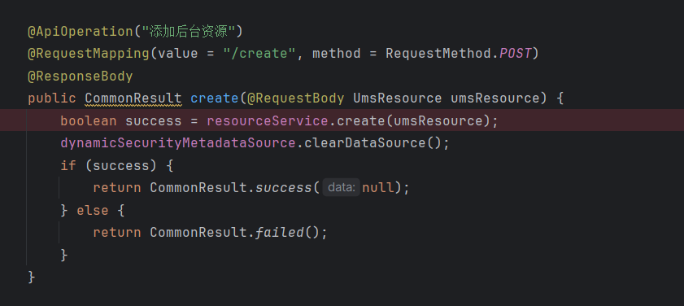
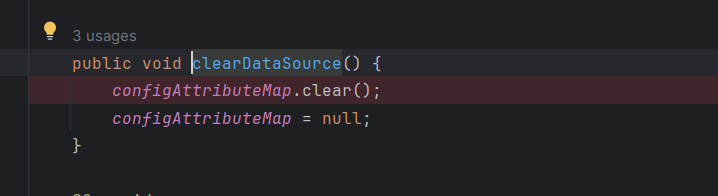
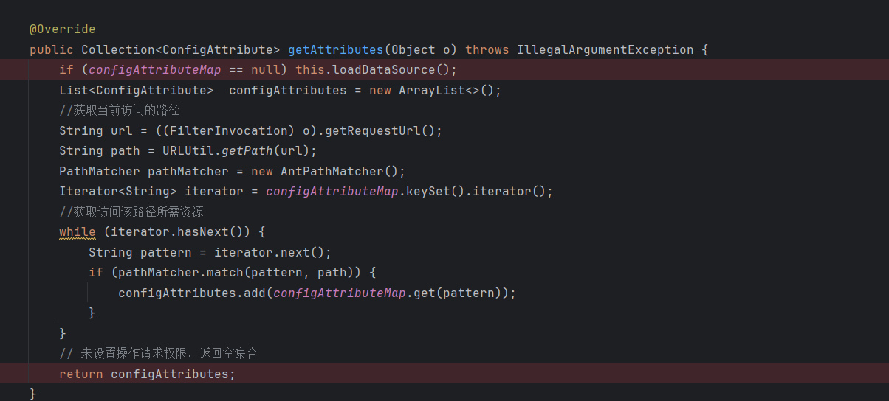
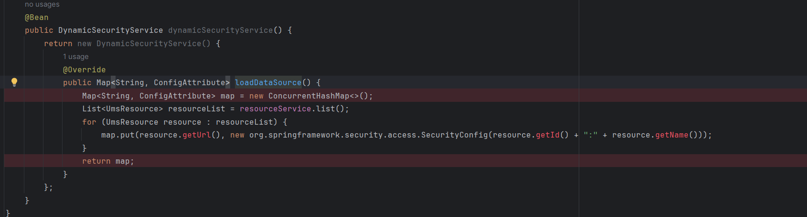
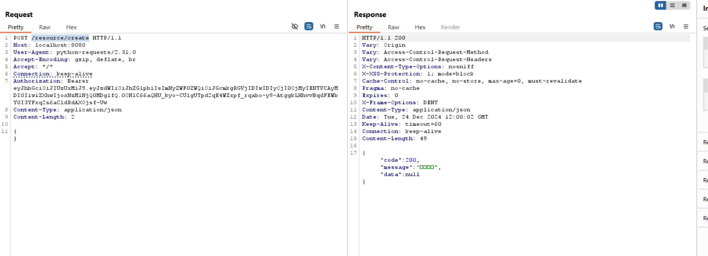
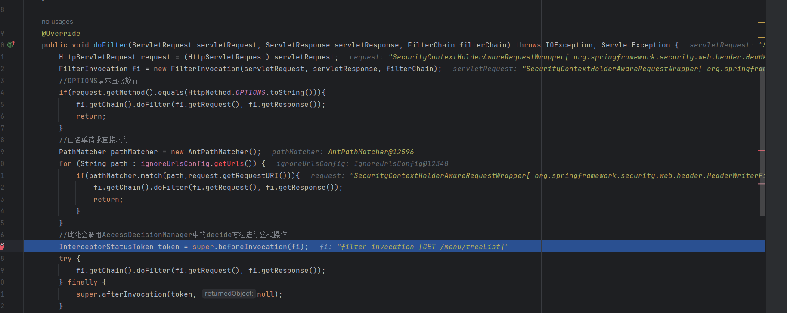
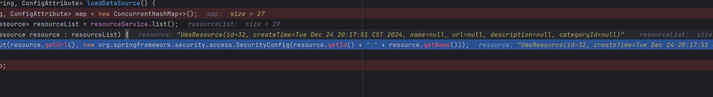
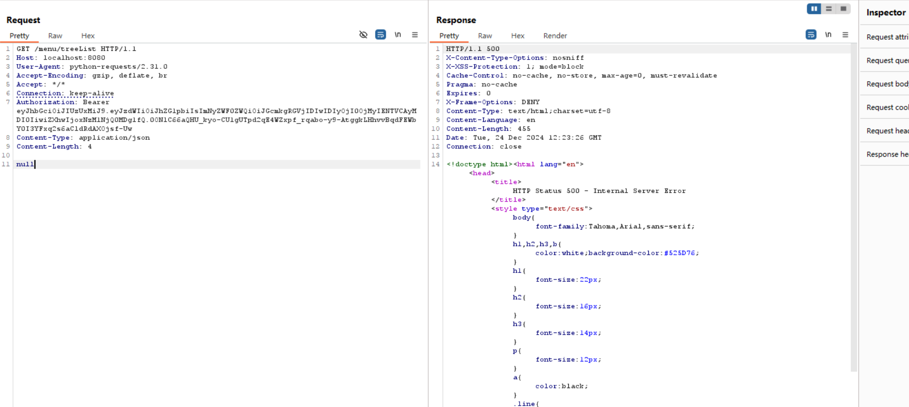
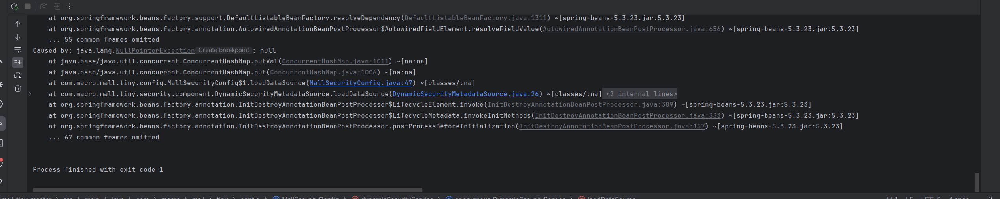

## The mall-tiny administrator account has a weak password and can be enumerated.

The mall-tiny project is a small e-commerce platform with 1.9k stars on GitHub. If an attacker sends null data through its resource update interface, null pointer dereferencing occurs for all subsequent operations that require authentication, which triggers a denial-of-service attack and service restart failure.

### Version & Reference

mall-tiny project 1.0.1

https://github.com/macrozheng/mall-tiny

https://www.macrozheng.com/

https://www.macrozheng.com/admin/index.html#/login

### Vulnerability causes

If we use the /resource/create interface to add a resource, the original data is cleaned up in the clearDataSource function.

Specifically the map data structure storing the resource is cleaned up and set to null.

On the next access, the resource is reloaded if the map is null.

Load the id and name of the resource in turn, but if the name is null when we submit the resource, the getName function will have a null pointer dereference, and the function exists in the authentication process, so all subsequent interfaces that require permissions will be affected, except for whitelisting operations. And in the service restart, because the map is null, so also to call the function, so also can not restart the service. Only by deleting the null data in the database can the service be restored to normal.

### Vulnerability reproduce & Impact

The attacker creates a resource using any user who has permission to create resources, using his token, and with empty content.

Call either interface into the function.

You can see that name is null, and null pointer dereference occurs at this point.

The response returns an internal service error.

Restarting the service still results in a null pointer dereference and cannot be restarted.

The vulnerability can lead to a denial-of-service attack, and exploitation requires a user with resource creation privileges.

This user can be obtained through another vulnerability of this project, jwt forgery, as detailed at https://github.com/peccc/restful_vul/blob/main/mall_tiny_weak_jwt/mall_tiny_weak_jwt.md .