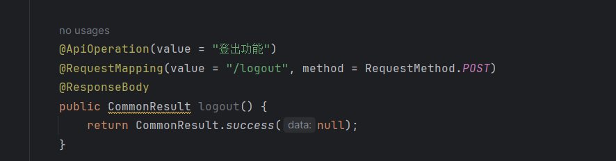
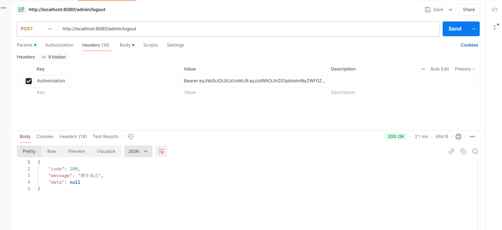
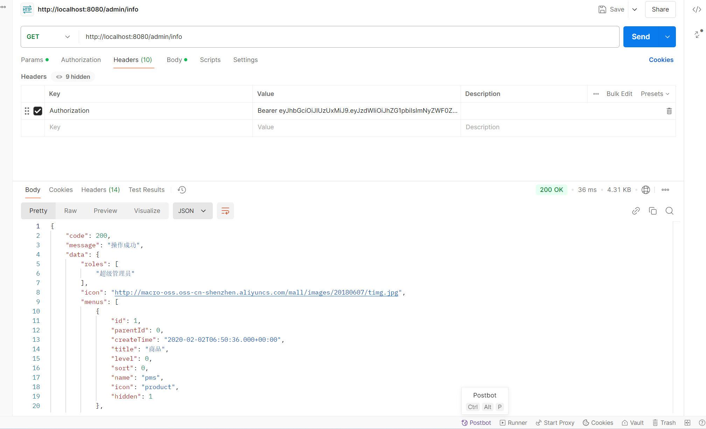

## Mall-tiny project logout failure

The mall-tiny project is a small e-commerce platform with 1.9k stars on GitHub, which fails the logout feature, and after a user logs out, his or her token is still available and fetches information in the logged-in state.

### version & reference

1.0.1

https://github.com/macrozheng/mall-tiny

https://www.macrozheng.com/

https://www.macrozheng.com/admin/index.html#/login

### Vulnerability causes

It has a failed logout feature that affects the module https://github.com/macrozheng/mall-tiny/blob/master/src/main/java/com/macro/mall/tiny/modules/ums/controller/ UmsAdminController.java, logout function
The web interface is http://XXX/admin/logout

This function should set the user's login status to false, but nothing is done, causing the logout function to fail and the token to continue to be used

### Vulnerability reproduce & Impact

After stealing or foging a token, an attacker can ignore a user's login status and gain access to the information and privileges of that user's login status.

You can see that the original user is still logged in after logging out. This vulnerability could lead to information leakage.