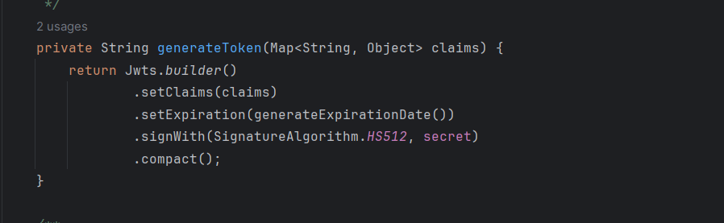
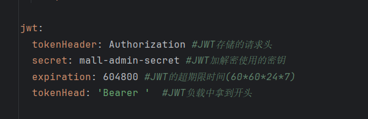
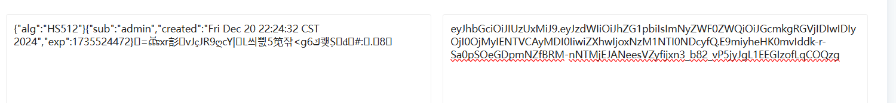
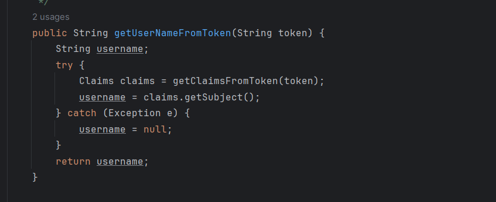
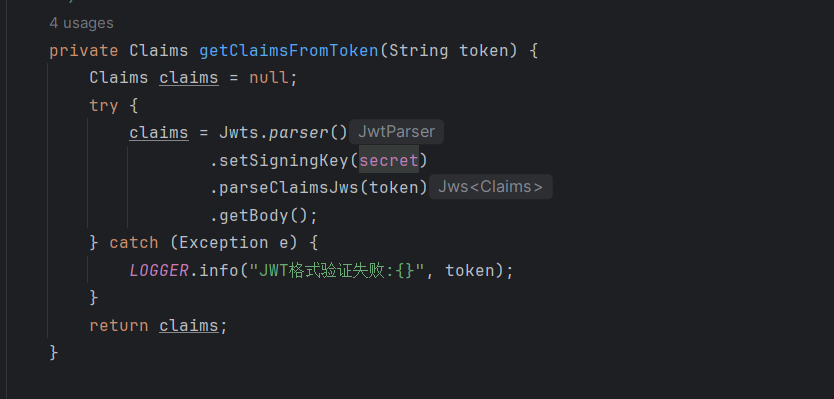
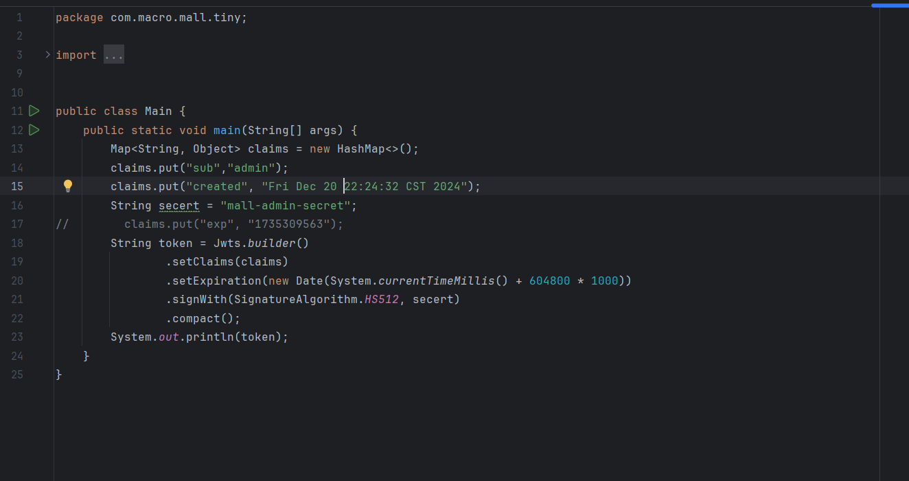
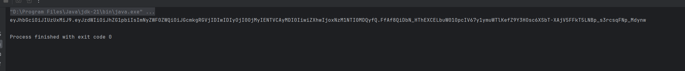
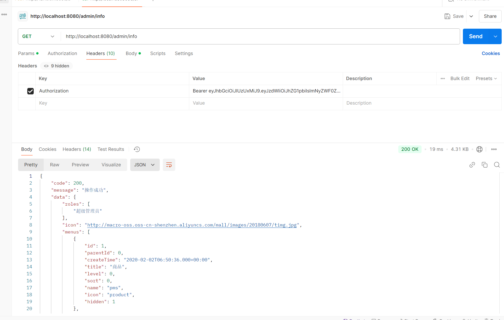

## Jwt forgery vulnerability in mall-tiny project

The mall_tiny project is a small e-commerce platform that uses restful api and implements authentication and permission management based on jwt. However jwt's signing keys are hardcoded and do not change. User information is explicitly written into jwt and used for subsequent privilege management, so it is possible to forge the jwt of any user in the system to achieve authentication bypass.

### Version & Reference

mall-tiny project 1.0.1 

https://github.com/macrozheng/mall-tiny

https://www.macrozheng.com/

https://www.macrozheng.com/admin/index.html#/login

### Vulnerability causes

You can see that the signing key used here is hardcoded, and further, the token content contains the username.

This username is subsequently used for authentication, so it is possible to forge the token of any user in the system.

### Vulnerability reproduce & Impact

We can write the above code to fake the token, here we fake the token of the admin user, which is a super user.

We managed to get the token.

Use this token to get the current user information, you can see that we are “超级管理员”, which stands for super user.

This vulnerability can lead to elevation of privilege.