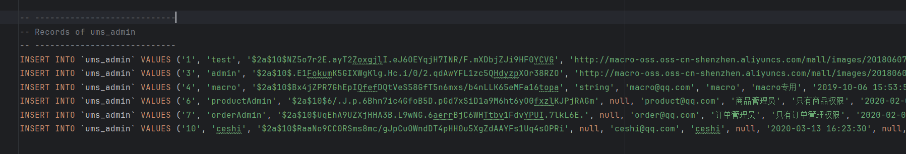
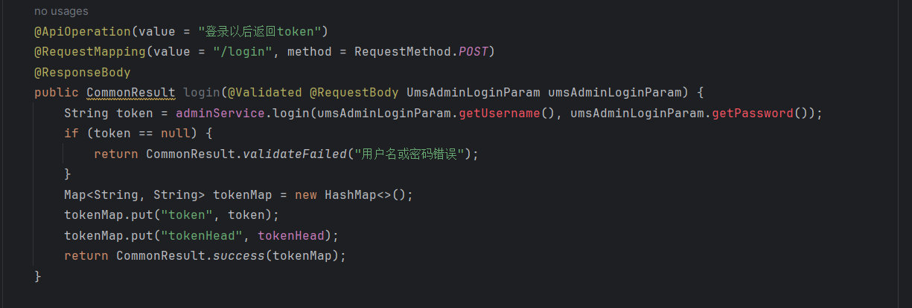
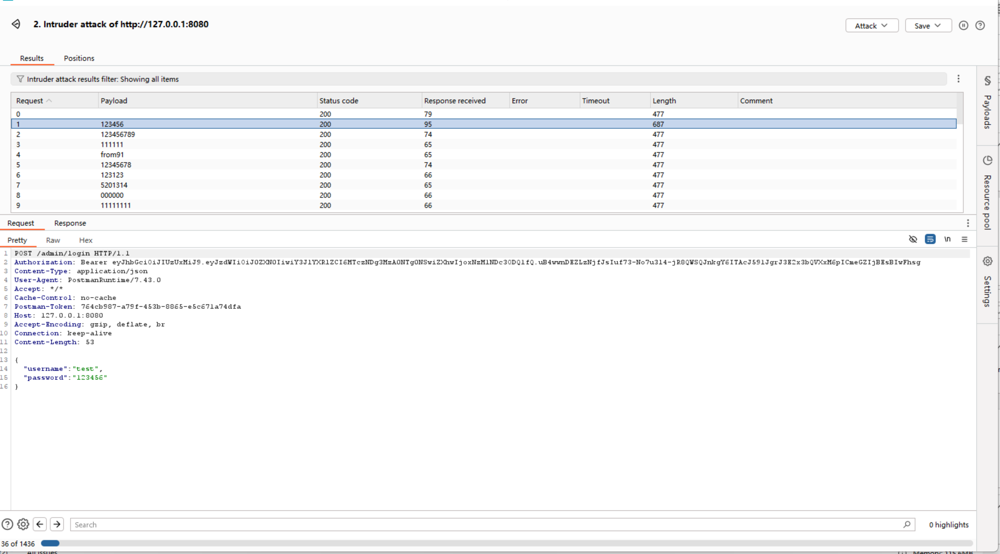
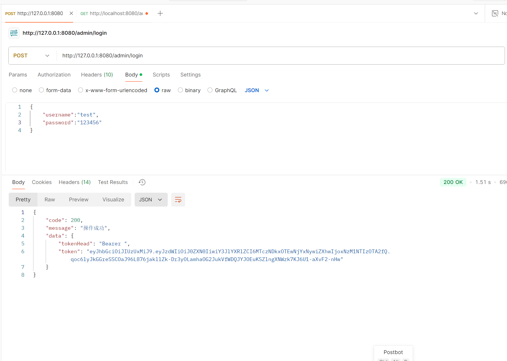
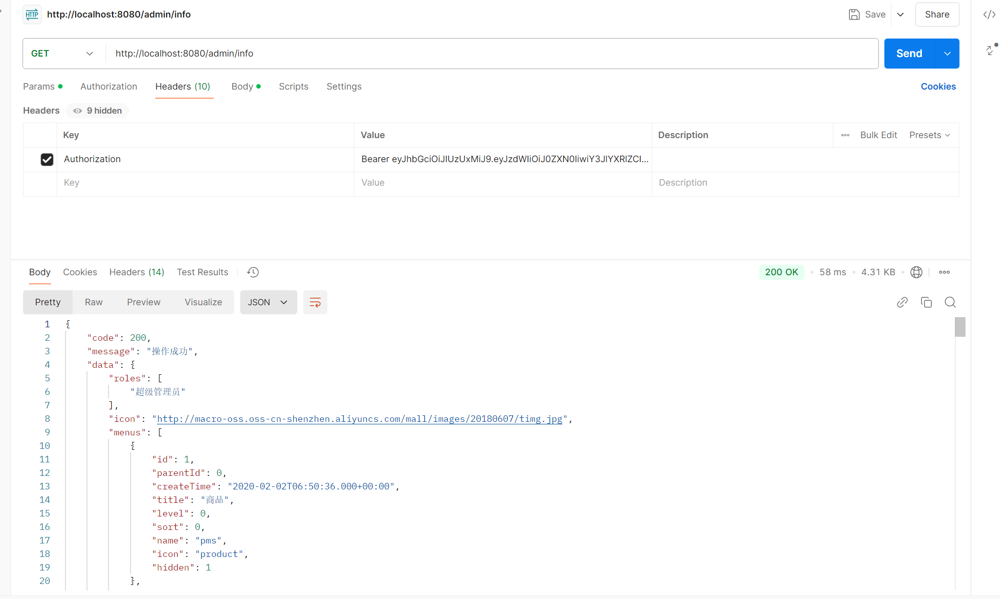

## The mall-tiny administrator account has a weak password and can be enumerated.

The mall-tiny project is a small e-commerce platform with 1.9k stars on GitHub. Its login interface can be password-enumerated, and weak passwords exist for the default superadmin.

### Version & Reference

1.0.1

https://github.com/macrozheng/mall-tiny

https://www.macrozheng.com/

https://www.macrozheng.com/admin/index.html#/login

### Vulnerability causes

The project imports users by default and the test user is a super administrator and has a weak password.

And the login interface can try multiple times without a lock, so an attacker can enumerate passwords

### Vulnerability reproduce & Impact

We use burp suite to burst the interface, you can see that the first can be burst successfully.

Use this password to log in and you will see a successful login.

We checked the user's permissions and found that the user is a super administrator.You can see that we are “超级管理员”, which stands for super user.

The vulnerability could lead to information disclosure and elevation of privilege.