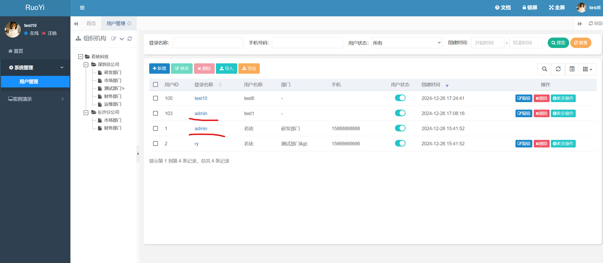

## Ruoyi system user unique identifiers can be duplicated leading to denial of service attacks

The ruoyi project, a 6.6k star GitHub project also open sourced on gitee, is vulnerable to a denial of service.In ruoyi system, loginName is a non-repeatable user name, users use loginName for system login. Its reset password interface can cause this field to be duplicated, and a duplicated loginName cannot be logged in, so this vulnerability can cause any user to be unable to log in, including the admin user. The system is set up so that no user can modify the admin user's information to ensure that the user is available, but this can lead to a denial of service attack by preventing the admin user from logging in.

### Version & Reference

ruoyi project 4.8.0

https://gitee.com/y_project/RuoYi

https://github.com/yangzongzhuan/RuoYi

https://ruoyi.vip/

### Vulnerability causes

Other interfaces ensure the uniqueness of the loginName when changing it, such as the user management interface

However, when resetting the password, it is not checked and the original loginName is overwritten, so it can be duplicated with other loginNames on the system, including the admin user.

### Vulnerability reproduce & Impact

Attackers need to have user administration privileges after logging in. The red line is the loginName, which cannot be duplicated.

At this point the admin user can log in.

Sends a password change message and changes the loginName.

At this point the admin loginName is duplicated.

logged into admin again and could not log in.

Originally, a query to the database should only return one result, but 2 are returned, and authentication fails for login.

This vulnerability requires the attacker to have user management privileges, and the impact is that it can cause any user in the system to be unable to log in, including the admin user, resulting in a denial of service attack. The attacker can make the whole system only he can log in.