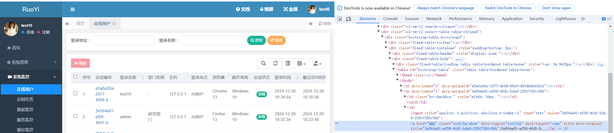
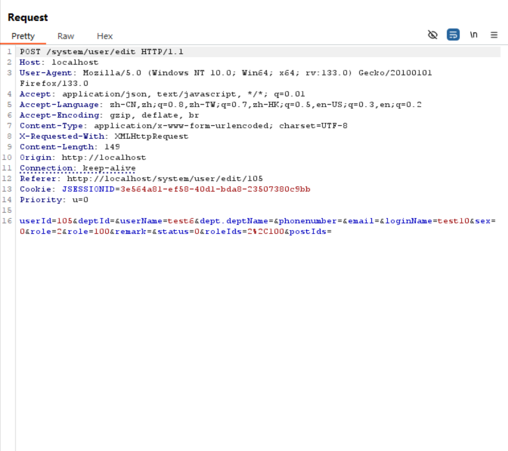
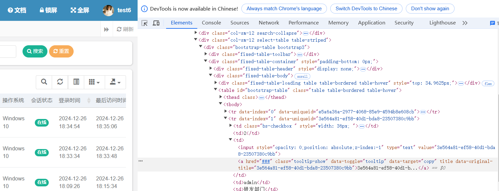
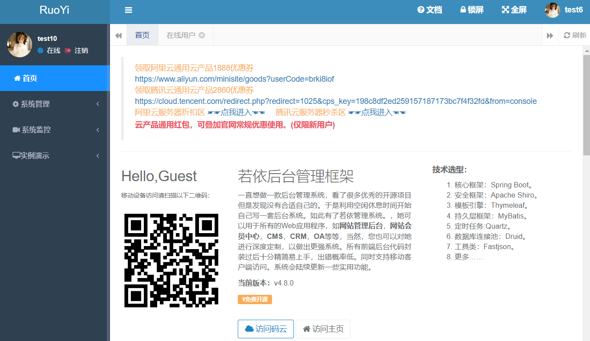
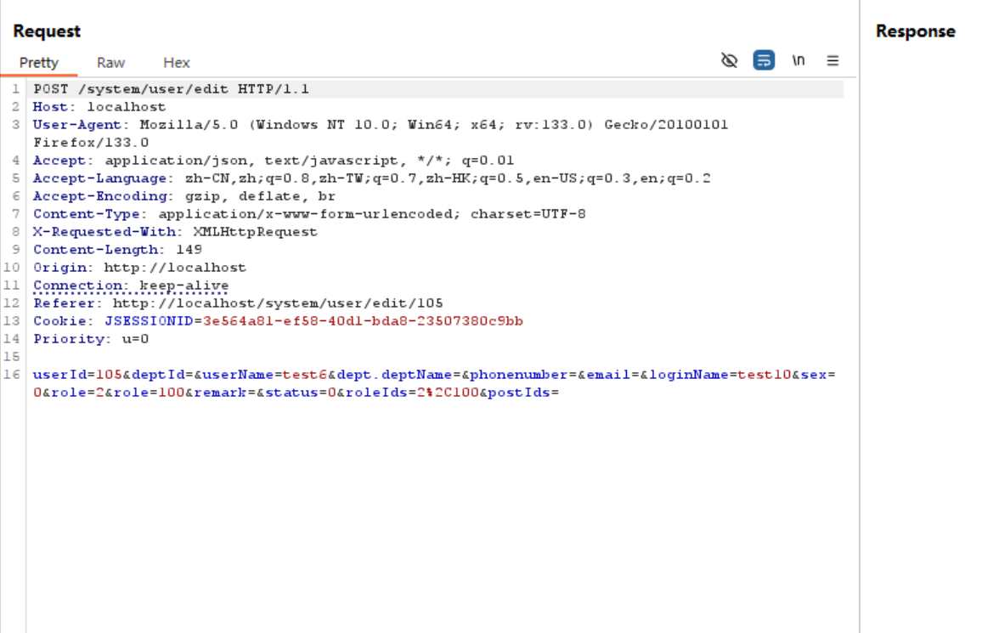
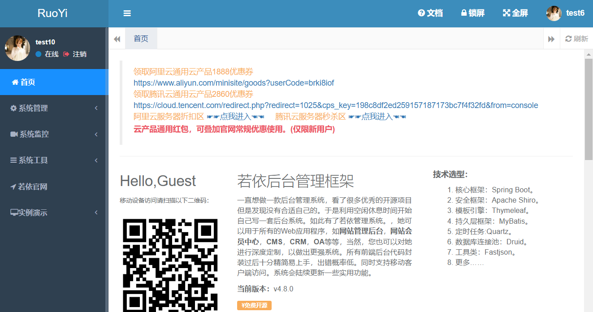

## Elevation of privilege vulnerability in the ruoyi project

The ruoyi project is a 6.6k GitHub project that has an elevation of privilege vulnerability.Users with system monitoring privileges can see the session id of admin, and this system recognizes users by their session ids, so users with system monitoring privileges can impersonate the session id of admin to achieve elevated privileges.

### Version & Reference

ruoyi project 4.8.0

https://ruoyi.vip/

https://github.com/yangzongzhuan/RuoYi

https://gitee.com/y_project/RuoYi

### Vulnerability causes

The session id of the admin can be seen in the system monitor, and the session id is used as an identifier to recognize the identity when the message is sent, so identity impersonation can be realized.

You can see that the session id is exactly the same, 3e.... .bb is what is in the cookie. Therefore identity impersonation can be realized.

### Vulnerability reproduce & Impact

Further privilege elevation can be done using the session id of admin.

At first we didn't have full access.

Use the admin identity to assign permissions.

At this point we have full access.

The vulnerability is exploited by a user with system monitoring privileges, admin user online. The impact is an elevation of privilege.