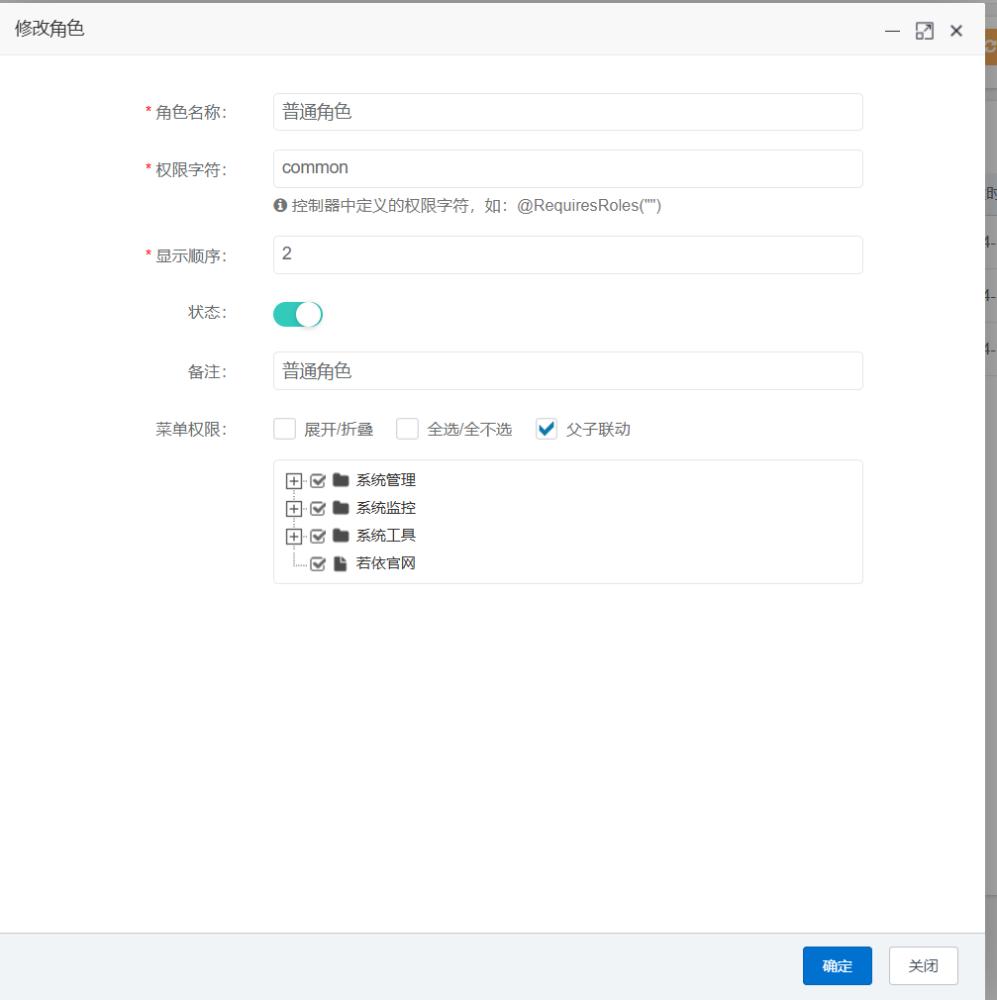

## The ruoyi project has insecure role assignments

The ruoyi project, a GitHub project with 6.6k stars and also open-sourced on gitee, has a vulnerability that could allow a user in a low-privilege role to give themselves a high-privilege role, which could lead to elevation of privilege.

### Version & Reference

ruoyi project 4.8.0

https://gitee.com/y_project/RuoYi

https://github.com/yangzongzhuan/RuoYi

https://ruoyi.vip/

### Vulnerability causes

The interface is to change user information and also make changes to the user's role. When updating, the interface only checks if the user can update the user role, but does not check if the updated role has higher privileges. Therefore the interface can assign itself a role with higher privileges.

### Vulnerability reproduce & Impact

There are two roles in the system the first role has more privileges than the second role, create a user with the second role privileges.

Assign the first role, a higher privilege role, to this user. Check and assign.

A higher privileged role is successfully assigned to the user, and other accessible interfaces can be seen in the left directory.

This vulnerability requires that a higher privileged role exists on the system and that the attacker has user administrative privileges. The impact is that elevation of privilege is possible.